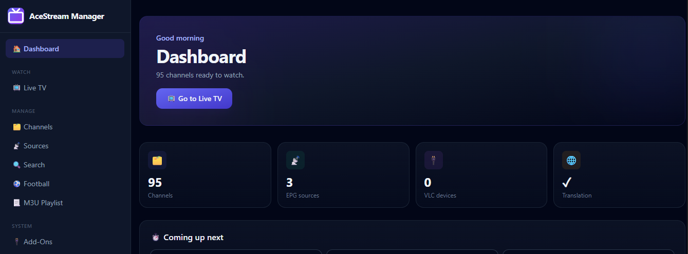
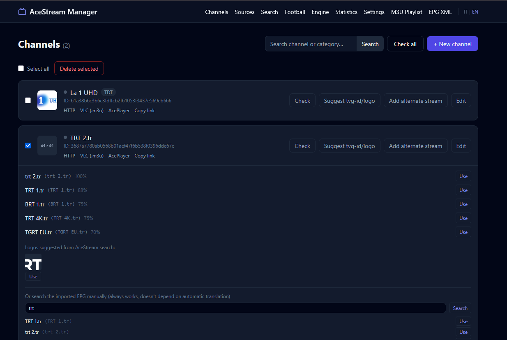
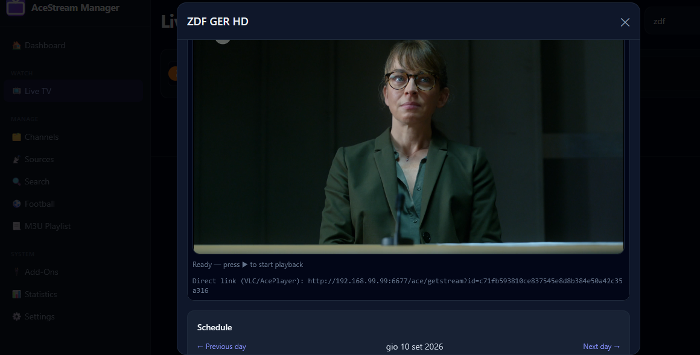
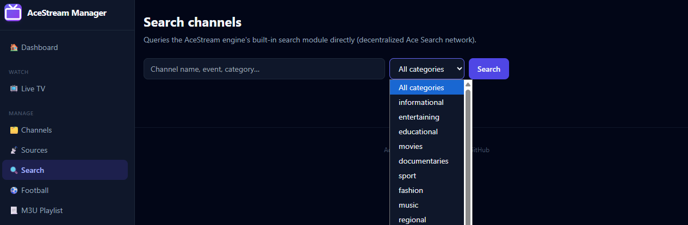
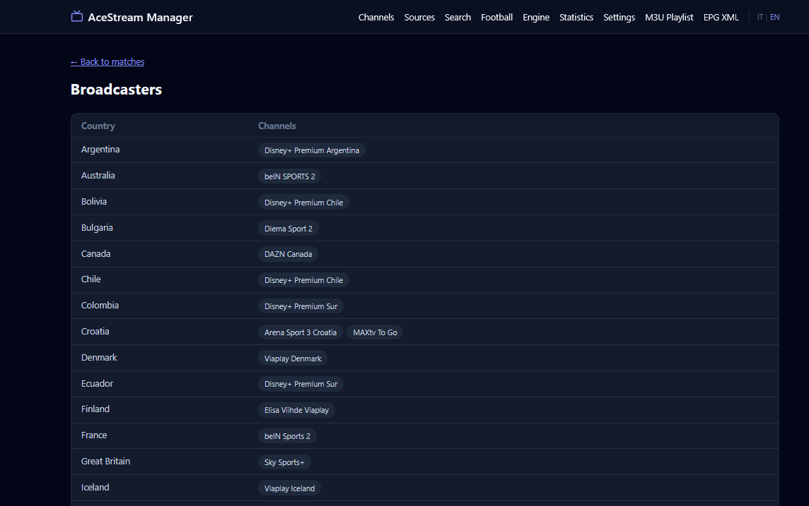
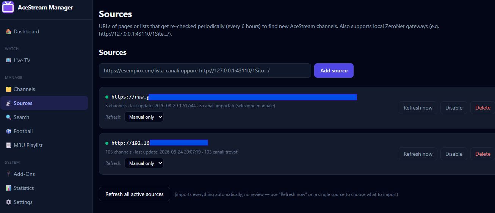
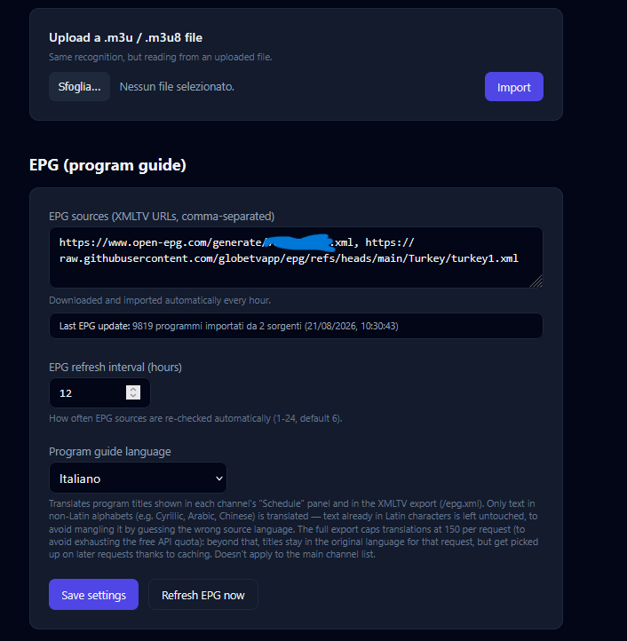
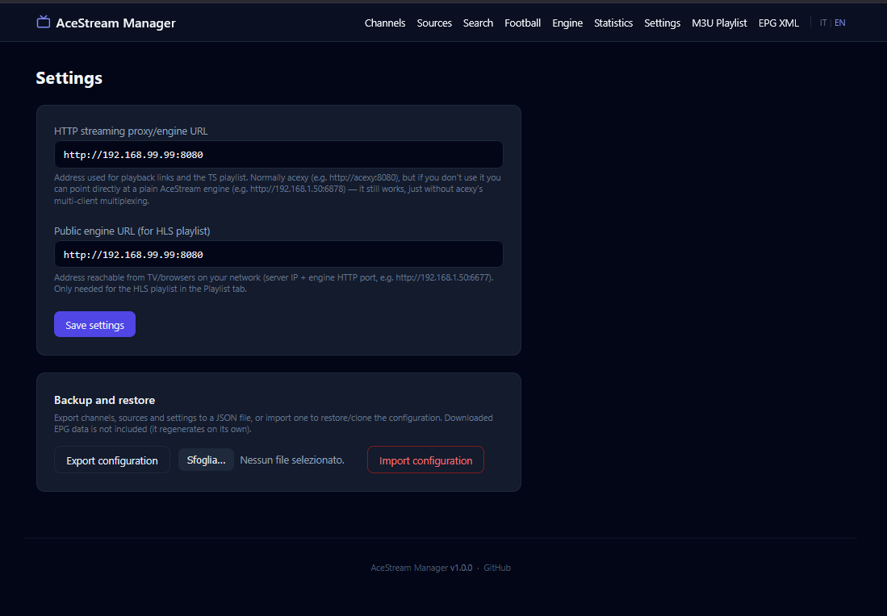
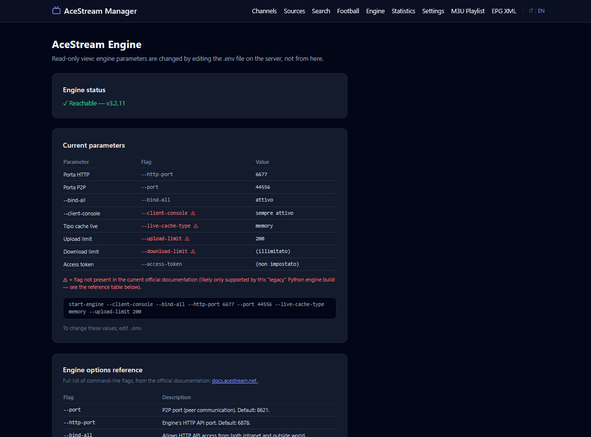
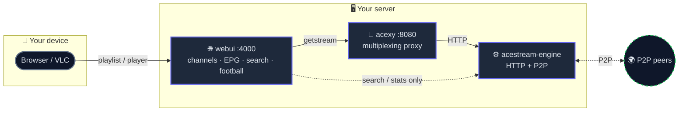

# AceStream Manager

[](https://docs.docker.com/compose/)
[](https://nodejs.org/)
[]()
[](.github/workflows/docker-build.yml)

Self-hosted, self-maintained Docker stack for AceStream — full control over your own streaming setup, no third-party servers involved: **multi-client streaming** via a CI-rebuilt engine and proxy, **smart channel/EPG matching** that works even across alphabets, **dual TS/HLS playlists**, **AceStream search with bulk import**, and a **live read-only engine dashboard** — all from one web app.

Found a bug? [Open an issue](https://github.com/gabo-it/Acestream-Manager/issues). Have a suggestion or question? [Start a discussion](https://github.com/gabo-it/Acestream-Manager/discussions).

## 💜 Donations

Donations don't fund further development — this project is maintained regardless. They're simply a welcome way to say thanks if the project has been useful to you.

<p align="center">
  <a href="https://github.com/sponsors/gabo-it"></a>
  &nbsp;&nbsp;
  <a href="https://buymeacoffee.com/gabo_it"></a>
</p>

## 📸 Screenshot

<table>
<tr>
<td align="center"><b>Home</b><br><a href="images/home.png"></a></td>
<td align="center"><b>Home</b><br><a href="images/home2.png"></a></td>
<td align="center"><b>Webplay</b><br><a href="images/webplay.png"></a></td>
<td align="center"><b>Search</b><br><a href="images/search.png"></a></td>
<td align="center"><b>Football Fixtures</b><br><a href="images/fixtures.png"></a></td>
</tr>
<tr>
<td align="center"><b>Sources 1</b><br><a href="images/sources1.png"></a></td>
<td align="center"><b>Sources 2</b><br><a href="images/sources2.png"></a></td>
<td align="center"><b>Settings</b><br><a href="images/settings.png"></a></td>
<td align="center"><b>Engine</b><br><a href="images/engine.png"></a></td>
</tr>
</table>

---

## ✨ Features

### 📺 Channels
CRUD, search, bulk select/delete · online/offline status check (single or all at once) · import from URL, pasted M3U, or uploaded file (per-source auto-refresh schedule, with a picker to choose what to import) · link alternate streams to a shared EPG · automatic tvg-id/logo suggestions — even across alphabets (e.g. Cyrillic ↔ Latin), plus a manual EPG search that always works regardless of automatic matching · play via the built-in web player, a one-click `.m3u` download for VLC, an AcePlayer link, or copy the direct link

### 🔍 Search
AceStream's own search API with category filtering — select and bulk-import results with one click, same playback options as regular channels

### 📅 EPG
Auto-import from XMLTV sources, configurable refresh interval · keeps the last good guide if a refresh fails or hits a rate limit · expandable daily schedule per channel with previous/next-day navigation · optional program-title translation (Italian/English/French/Spanish) for non-Latin alphabets

### 📃 Playlists
Two auto-generated variants: MPEG-TS via acexy (recommended, multi-client) and HLS via the native engine endpoint (experimental)

### ⚽ Football *(experimental)*
Search a team through a local index built from major league standings, browse matches, and see broadcasters grouped by country

### ⚙️ Engine
Read-only dashboard of the running engine's live parameters and status, with unofficial/legacy flags flagged in red against the official docs

### 📊 Statistics
Live peers/speed for any stream (optionally pointing at a different engine), plus a list of streams currently playing through this web UI

### 🌍 Everything else
Italian/English interface · one-click configuration export/import · weekly engine image rebuilds via GitHub Actions · all AceStream caching kept in RAM

---

## 🏗️ Architecture



| Service | Role |
|---------|------|
| `acestream` | AceStream engine — image built by this repo's own CI |
| `acexy` | [Javinator9889/acexy](https://github.com/Javinator9889/acexy) — multiplexes streams so multiple clients/channels don't collide (the engine alone allows one client per channel) |
| `webui` | This app: channels, playlists, EPG, search, football, statistics |

> [!TIP]
> **Always play through acexy**, not the engine directly — the engine is only queried directly for Search and Statistics, which acexy doesn't expose. There's exactly one P2P port in the whole stack, on the `acestream` service; acexy does no P2P work of its own, it's a plain HTTP proxy.

Ports published on the host: engine HTTP `6677` (serves the HLS playlist), engine P2P `44556` (TCP+UDP — forward it on your router if behind NAT), acexy `8080`, webui `4000`.

---

## 🚀 Quick start

### Docker Compose (recommended)

Create a `docker-compose.yml` with the content below, adjust any values directly in it (ports, engine limits, acexy tuning — everything is right here, no separate `.env` file needed), then run `docker compose up -d`. Works whether you clone the repo or just paste this into a Portainer stack.

```yaml
services:
  acestream:
    image: ghcr.io/gabo-it/acestream-engine:latest
    container_name: acestream-engine
    restart: unless-stopped
    environment:
      HTTP_PORT: "6677"
      PORT: "44556"
      ACCESS_TOKEN: ""          # set this if this port is reachable beyond your LAN
      # Everything else the engine supports goes in this one line — add,
      # remove, or change any official flag directly here. Reference:
      # https://docs.acestream.net/developers/engine-command-line-options/
      ENGINE_FLAGS: "--client-console --bind-all --live-cache-type memory"
    expose:
      - "6677"
    ports:
      - "6677:6677"
      - "44556:44556/tcp"
      - "44556:44556/udp"
    networks:
      - acestream-net
    healthcheck:
      test: ["CMD-SHELL", "wget -q -t1 -O- http://127.0.0.1:6677/webui/api/service?method=get_version | grep -q '\"error\": null'"]
      interval: 30s
      timeout: 5s
      retries: 3
      start_period: 25s
    tmpfs:
      - /srv/ace/.ACEStream:size=512m,mode=1777   # keeps all engine caching in RAM

  acexy:
    image: ghcr.io/javinator9889/acexy:0.2.2
    container_name: acexy
    restart: unless-stopped
    depends_on:
      acestream:
        condition: service_healthy
    environment:
      ACEXY_HOST: acestream
      ACEXY_PORT: "6677"
      ACEXY_LISTEN_ADDR: ":8080"
      ACEXY_NO_RESPONSE_TIMEOUT: 30s   # raise if streams fail with "timeout awaiting response headers"
      ACEXY_BUFFER_SIZE: 4.2MiB        # raise if playback is choppy
      ACEXY_CLIENT_EVICTION_TIMEOUT: 10s
    ports:
      - "8080:8080"
    networks:
      - acestream-net

  webui:
    image: ghcr.io/gabo-it/acestream-webui:latest
    container_name: acestream-webui
    restart: unless-stopped
    depends_on:
      - acexy
    environment:
      PORT: "4000"
      DB_PATH: /data/acestream.db
      ACESTREAM_HTTP_PORT: "6677"
    volumes:
      - webui-data:/data
    ports:
      - "4000:4000"
    networks:
      - acestream-net

networks:
  acestream-net:
    driver: bridge

volumes:
  webui-data:
```

- Web UI: http://localhost:4000
- Playlist (TS, recommended): http://localhost:4000/playlist.m3u8
- EPG XMLTV: http://localhost:4000/epg.xml

> [!NOTE]
> Without a mounted `.env` file, the **Engine** tab shows built-in defaults rather than these exact values (it just can't read them back) — harmless, since you can see and edit them right here in the compose file. If you'd rather have the Engine tab reflect live values, clone the repo instead and follow the "Deploying your own fork" section below — its `docker-compose.yml` reads from a `.env` file both services share.

### With plain `docker run`

Possible if you'd rather not use Compose, but you lose the automatic "wait for the engine to be healthy before starting acexy" behavior — start them in order and give the engine a few seconds.

```bash
# 1. Shared network
docker network create acestream-net

# 2. Engine (adjust HTTP_PORT/PORT to taste — must match what you pass to acexy/webui below)
docker run -d --name acestream-engine \
  --network acestream-net --restart unless-stopped \
  -e HTTP_PORT=6677 -e PORT=44556 \
  -e ENGINE_FLAGS="--client-console --bind-all --live-cache-type memory" \
  -p 6677:6677 -p 44556:44556/tcp -p 44556:44556/udp \
  --tmpfs /srv/ace/.ACEStream:size=512m,mode=1777 \
  ghcr.io/gabo-it/acestream-engine:latest

# wait ~20-30s for the engine to finish starting up, then:

# 3. acexy (points at the engine by container name, via the shared network)
docker run -d --name acexy \
  --network acestream-net --restart unless-stopped \
  -e ACEXY_HOST=acestream-engine -e ACEXY_PORT=6677 -e ACEXY_LISTEN_ADDR=:8080 \
  -e ACEXY_NO_RESPONSE_TIMEOUT=30s -e ACEXY_BUFFER_SIZE=4.2MiB -e ACEXY_CLIENT_EVICTION_TIMEOUT=10s \
  -p 8080:8080 \
  ghcr.io/javinator9889/acexy:0.2.2

# 4. Web UI (needs a writable .env on the host for the Engine tab, and a volume for its database)
docker volume create webui-data
cp .env.example .env   # must exist first
docker run -d --name acestream-webui \
  --network acestream-net --restart unless-stopped \
  -e PORT=4000 -e DB_PATH=/data/acestream.db -e ENV_FILE_PATH=/config/.env -e ACESTREAM_HTTP_PORT=6677 \
  -v webui-data:/data -v "$(pwd)/.env:/config/.env" \
  -p 4000:4000 \
  ghcr.io/gabo-it/acestream-webui:latest
```

**Note**: with `docker run`, if you change a port later you have to `docker rm -f` and re-run each affected container with the new `-p`/`-e` values by hand — Compose does this for you with a single `docker compose up -d`. For anything beyond a quick one-off test, Compose is the path this project actually supports day-to-day.

---

## ⚙️ Key settings

Engine parameters (ports, bandwidth, cache, access token) live in `.env` — view them (read-only) in the **Engine** tab, edit the file directly, then `docker compose up -d`. Acexy tuning also lives in `.env`:

| Variable | Default | When to change it |
|----------|---------|--------------------|
| `ACEXY_NO_RESPONSE_TIMEOUT` | `30s` | Raise if streams fail with "timeout awaiting response headers" |
| `ACEXY_BUFFER_SIZE` | `4.2MiB` | Raise if playback is choppy vs. hitting the engine directly |
| `ACEXY_CLIENT_EVICTION_TIMEOUT` | `10s` | Raise if brief player hiccups cause visible stutter |

In the web UI, **Settings** has the Acexy/engine public URLs (needed for playback links to work from other devices) and configuration export/import. **Sources** has EPG configuration (XMLTV URLs, refresh interval, program-guide translation language) alongside channel source management, since both are about keeping content fresh.

---

## 🔄 Deploying your own fork

Canonical repository: [gabo-it/Acestream-Manager](https://github.com/gabo-it/Acestream-Manager). To run your own fork with your own published images instead of `gabo-it`'s:

```bash
git init && git add . && git commit -m "Initial commit"
git branch -M main
git remote add origin https://github.com/<your-username>/<your-repo>.git
git push -u origin main
```

Set `GITHUB_OWNER=<your-username>` in `.env`. Repo Settings → Actions → General → Workflow permissions needs **"Read and write permissions"** for the CI to publish images — it then rebuilds on every push to `main`, and weekly for new AceStream engine releases. Update your server with `docker compose pull && docker compose up -d`.

### About GitHub Releases

The **Releases** tab on GitHub is separate from this — it's not populated automatically. This project's CI publishes container images to GHCR (Packages), not GitHub Releases. If you want tagged releases too (e.g. `v1.0.0`), create them yourself: `git tag v1.0.0 && git push --tags`, then GitHub → Releases → "Draft a new release" and pick that tag. Entirely optional; nothing else in this project depends on it.

### Checking for leaked secrets in your git history

If you're ever unsure whether an old commit accidentally included something sensitive (an API key, a token, a `.env` file committed before it was gitignored):
- **GitHub's own secret scanning** runs automatically on public repos — check Settings → Security → Secret scanning alerts.
- **[gitleaks](https://github.com/gitleaks/gitleaks)** (`gitleaks detect --source . -v`) scans your full commit history locally for common secret patterns — the most practical one-command check.
- Specifically check whether `.env` was ever committed before your `.gitignore` existed: `git log --all --full-history -- .env`. If it shows commits, those old blobs still contain the file's contents even after later deleting it — you'd need to rewrite history (`git filter-repo` or BFG Repo-Cleaner) and rotate any exposed credentials, not just delete the file going forward.

---

## 🐛 Troubleshooting

<details>
<summary>Streams time out via acexy but work hitting the engine directly</summary>

Raise `ACEXY_NO_RESPONSE_TIMEOUT` (try `60s`), check the P2P port is actually reachable from the internet (router port-forward), and make sure `ACEXY_BUFFER_SIZE`/`ACEXY_CLIENT_EVICTION_TIMEOUT` aren't too tight for your connection.
</details>

<details>
<summary>Web player fails, but VLC/AcePlayer play the same link fine</summary>

Try **Firefox** first — Chromium's (Chrome/Edge) MediaSource Extensions are confirmed stricter than Firefox's for some H.264 streams. Otherwise the stream likely uses a codec browsers can't decode via MSE (e.g. MPEG-2), which needs server-side transcoding (not included here). The direct link is always shown under the player.
</details>

<details>
<summary>Clicking VLC does nothing</summary>

VLC doesn't register a `vlc://` protocol handler by default on any OS. This project downloads a one-channel `.m3u` file instead, which opens in VLC if it's your default `.m3u` handler (common after a normal install).
</details>

<details>
<summary>AcePlayer shows "engine_not_connected"</summary>

`acestream://` links expect a *local* engine on your device, not a remote one — use the HTTP or VLC download buttons instead.
</details>

<details>
<summary>"EISDIR" error, or wrong ghcr.io image after editing .env.example</summary>

`.env` (not `.env.example`) must exist on the host before first startup — Docker creates a directory there otherwise. Fix: `docker compose down && rm -rf ./.env && cp .env.example .env && docker compose up -d`. Editing `.env.example` never updates an already-existing `.env`.
</details>

<details>
<summary>tvg-id/logo suggestions don't find a match for a channel</summary>

Cross-alphabet matching (e.g. a channel named in Latin script vs. an EPG entry in Cyrillic/Arabic/etc.) depends on a free translation API and can occasionally miss due to spelling variants. The **manual search box** inside the suggestion panel always works regardless — type any part of the name in any alphabet and pick directly from the imported EPG.
</details>

<details>
<summary>GitHub Actions: <code>denied: permission_denied: read_package</code></summary>

Very common, well-documented GHCR issue — almost always a leftover package not linked to your repo, typically from an earlier failed/partial push.
1. Go to `https://github.com/<your-username>?tab=packages`, open the package
2. Package settings → Manage Actions access → add your repository with **Write** role — or delete the package entirely and let the next workflow run recreate it correctly linked
3. Also verify: repo Settings → Actions → General → Workflow permissions → "Read and write permissions"
</details>

<details>
<summary>A channel's EPG preview stays empty even after applying a tvg-id suggestion</summary>

Check Sources → "Last EPG update": if it lists an error for one of your XMLTV URLs, that whole source failed to parse — its channels' programs never got imported, even though the overall refresh reports partial success from the other sources. A common one: `Entity expansion limit exceeded` (some XMLTV feeds, e.g. German ones from open-epg.com, define more entities than the XML parser's default safety limit allows) — already raised in this project, but if you hit a similar error on a different feed, the limits are configurable in `epg.js`. Separately, an empty "now" preview can also just mean the guide has a genuine gap at the current hour — check the channel's "Schedule" panel for today to tell the two apart.
</details>

<details>
<summary>Football search can't find a team</summary>

Only teams in the indexed leagues (Serie A, Premier League, La Liga, Bundesliga, Ligue 1, Primeira Liga, Eredivisie, Süper Lig, MLS, Liga MX, Brasileirão, Champions League) are searchable. For others, paste the team's page URL from livesoccertv.com.
</details>

---


## 🙏 Credits

This project builds on the work of others — all the actual streaming plumbing comes from these upstream projects, this repo just wraps them in a web UI:

- **[acexy](https://github.com/Javinator9889/acexy)** by [Javinator9889](https://github.com/Javinator9889) — the multiplexing proxy that lets multiple clients/channels share one engine without colliding. This project wouldn't be usable by more than one viewer at a time without it.
- **[AceStream](https://acestream.org/)** — the underlying P2P streaming engine everything here is built around.
- **[mpegts.js](https://github.com/xqq/mpegts.js)** by [xqq](https://github.com/xqq) — powers the in-browser web player.

If any of these projects are useful to you through this one, consider starring their repos too.

---

<p align="center">
  <br/><br/>
  <a href="https://github.com/gabo-it/Acestream-Manager"><strong>github.com/gabo-it/Acestream-Manager</strong></a><br/>
  <sub>Self-hosted · self-maintained · made to be forked</sub>
</p>
