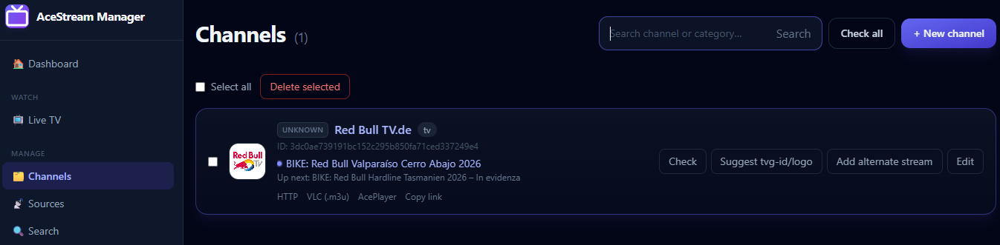
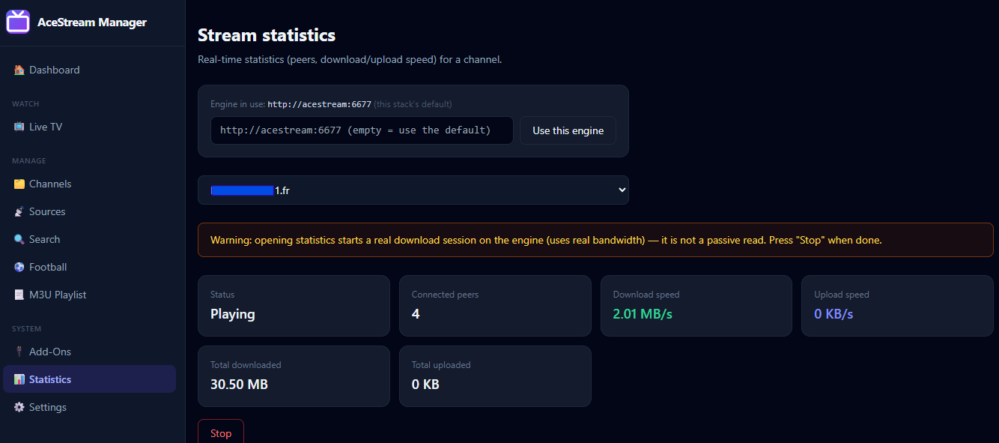
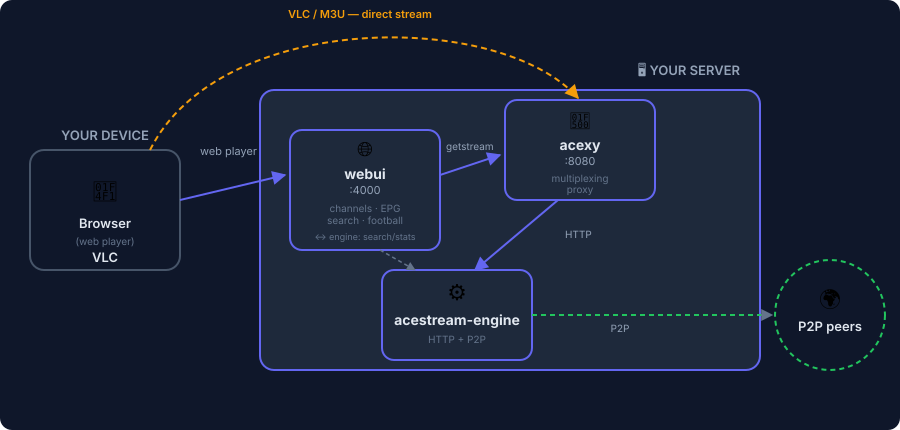

# AceStream Manager

[](https://docs.docker.com/compose/)
[](https://nodejs.org/)
[](LICENSE)
[](.github/workflows/docker-build.yml)

Self-hosted, self-maintained Docker stack for AceStream — full control over your own streaming setup, no third-party servers involved: **multi-client streaming** via a CI-rebuilt engine and proxy, **smart channel/EPG matching** that works even across alphabets, a **Live TV view** with now/next info per channel, **AceStream search with bulk import**, and **active integrations** (VLC remote control, Jellyfin, optional Cloudflare WARP) with a **LAN scanner** to find devices — all from one web app.

Found a bug? [Open an issue](https://github.com/gabo-it/Acestream-Manager/issues). Have a suggestion or question? [Start a discussion](https://github.com/gabo-it/Acestream-Manager/discussions).

## 💜 Donations

Donations don't fund further development — this project is maintained regardless. They're simply a welcome way to say thanks if the project has been useful to you.

<p align="center">
  <a href="https://github.com/sponsors/gabo-it"></a>
  &nbsp;&nbsp;
  <a href="https://buymeacoffee.com/gabo_it"></a>
</p>

## 📸 Screenshot

<table>
<tr>
<td align="center"><b>Dashboard</b><br><a href="images/home.png"></a></td>
<td align="center"><b>Sources</b><br><a href="images/sources1.png"></a></td>
<td align="center"><b>WebPlay</b><br><a href="images/webplay.png"></a></td>
</tr>
<tr>
<td align="center"><b>Channels</b><br><a href="images/search.png"></a></td>
<td align="center"><b>Search</b><br><a href="images/channels.png"></a></td>
<td align="center"><b>Statistics</b><br><a href="images/sources1.png"></a></td>
</tr>
</table>

> [!NOTE]
> These screenshots predate several redesigns (sidebar navigation, Live TV, Dashboard, the Engine tab's removal) — they still show the general idea, but some details no longer match the current UI exactly.

---

## ✨ Features

### 🏠 Dashboard
Landing page: channel/EPG-source/VLC-device counts, upcoming programs in the next 2 hours, recently added channels, last EPG refresh status — all clickable through to the relevant section

### 📡 Live TV
One row per channel with what's on now and what's next right alongside it — click a row to open a modal with the web player, full daily schedule, and one-click casting to any configured VLC device

### 📺 Channels
CRUD, search, bulk select/delete · online/offline status check (single or all at once) · import from URL, pasted M3U, or uploaded file (per-source auto-refresh schedule, with a picker to choose what to import) · link alternate streams to a shared EPG · automatic tvg-id/logo suggestions — even across alphabets (e.g. Cyrillic ↔ Latin), plus a manual EPG search that always works regardless of automatic matching · play via the built-in web player, a one-click `.m3u` download for VLC, an AcePlayer link, or copy the direct link

### 🔍 Search
AceStream's own search API with category filtering — select and bulk-import results with one click, same playback options as regular channels

### 📃 Playlist
MPEG-TS (via acexy, multi-client) and HLS (native engine endpoint) links, plus the combined EPG XMLTV export · EPG sources shown one per row with real per-source stats (last fetch time, program count, or the specific error if one failed) and a one-click add — not a wall of text to edit · optional program-title translation (English/Italian/French/Spanish) via a self-hosted [LibreTranslate](https://github.com/LibreTranslate/LibreTranslate) instance, CPU/RAM-capped so it can't overwhelm a shared host

### 🔌 Add-Ons
**VLC**: control remote VLC instances via their native HTTP interface — cast any channel to them with one click from Live TV. **Jellyfin**: active control via its REST API — test the connection and trigger a library refresh directly, plus the M3U/XMLTV URLs for its native Live TV tuner setup. **LAN scanner**: find VLC/Jellyfin candidates on your network by IP range instead of typing addresses by hand (Jellyfin candidates are verified against its public server-info endpoint, not just "something answered this port"). **Cloudflare WARP** *(optional, off by default)*: status check for the webui's own outbound requests — never routes AceStream/acexy traffic

### ⚽ Football *(experimental)*
Search a team through a local index built from major league standings, browse matches, and see broadcasters grouped by country

### 📊 Statistics
Live peers/speed for any stream (optionally pointing at a different engine), plus a list of streams currently playing through this web UI

### 🌍 Everything else
One-click configuration export/import · weekly engine image rebuilds via GitHub Actions · all AceStream caching kept in RAM

---

## 🏗️ Architecture



| Service | Role |
|---------|------|
| `acestream` | AceStream engine — image built by this repo's own CI |
| `acexy` | [Javinator9889/acexy](https://github.com/Javinator9889/acexy) — multiplexes streams so multiple clients/channels don't collide (the engine alone allows one client per channel) |
| `webui` | This app: channels, playlists, EPG, search, football, statistics |

> [!TIP]
> **Always play through acexy**, not the engine directly — the engine is only queried directly for Search and Statistics, which acexy doesn't expose. There's exactly one P2P port in the whole stack, on the `acestream` service; acexy does no P2P work of its own, it's a plain HTTP proxy.

Ports published on the host: engine HTTP `6677` (serves the HLS playlist), engine P2P `44556` (TCP+UDP — forward it on your router if behind NAT), acexy `8080`, webui `4000`.

---

## 🚀 Quick start

### Docker Compose (recommended)

Create a `docker-compose.yml` with the content below, adjust any values directly in it (ports, engine limits, acexy tuning — everything is right here, no separate `.env` file needed), then run `docker compose up -d`. Works whether you clone the repo or just paste this into a Portainer stack.

```yaml
services:
  acestream:
    image: ghcr.io/gabo-it/acestream-engine:latest
    container_name: acestream-engine
    restart: unless-stopped
    environment:
      HTTP_PORT: "6677"
      PORT: "44556"
      ACCESS_TOKEN: ""          # set this if this port is reachable beyond your LAN
      # Any official engine flag goes in this one line — reference:
      # https://docs.acestream.net/developers/engine-command-line-options/
      ENGINE_FLAGS: "--client-console --bind-all --live-cache-type memory"
      # Containers default to UTC — edit to your IANA timezone (e.g.
      # Europe/Rome) for correctly-timed container clocks/logs.
      TZ: "UTC"
    expose:
      - "6677"
    ports:
      - "6677:6677"
      - "44556:44556/tcp"
      - "44556:44556/udp"
    networks:
      - acestream-net
    healthcheck:
      test: ["CMD-SHELL", "wget -q -t1 -O- http://127.0.0.1:6677/webui/api/service?method=get_version | grep -q '\"error\": null'"]
      interval: 30s
      timeout: 5s
      retries: 3
      start_period: 25s
    tmpfs:
      - /srv/ace/.ACEStream:size=512m,mode=1777   # keeps all engine caching in RAM

  acexy:
    image: ghcr.io/javinator9889/acexy:0.2.2
    container_name: acexy
    restart: unless-stopped
    depends_on:
      acestream:
        condition: service_healthy
    environment:
      ACEXY_HOST: acestream
      ACEXY_PORT: "6677"
      ACEXY_LISTEN_ADDR: ":8080"
      ACEXY_NO_RESPONSE_TIMEOUT: 30s   # raise if streams fail with "timeout awaiting response headers"
      ACEXY_BUFFER_SIZE: 4.2MiB        # raise if playback is choppy
      ACEXY_CLIENT_EVICTION_TIMEOUT: 10s
      TZ: "UTC"
    ports:
      - "8080:8080"
    networks:
      - acestream-net

  webui:
    image: ghcr.io/gabo-it/acestream-webui:latest
    container_name: acestream-webui
    restart: unless-stopped
    depends_on:
      - acexy
    environment:
      PORT: "4000"
      DB_PATH: /data/acestream.db
      ACESTREAM_HTTP_PORT: "6677"
      TZ: "UTC"
    volumes:
      - webui-data:/data
    ports:
      - "4000:4000"
    networks:
      - acestream-net

  # Optional: self-hosted EPG translation / cross-alphabet matching.
  # Disabled by default: docker compose --profile translate up -d
  # Then: Playlist → "LibreTranslate URL" → http://libretranslate:5000
  libretranslate:
    image: libretranslate/libretranslate:latest
    container_name: libretranslate
    restart: unless-stopped
    profiles: ["translate"]
    environment:
      # ~200MB RAM per language loaded — adjust to your actual EPG languages.
      LT_LOAD_ONLY: en,it,ru
    volumes:
      - libretranslate-models:/home/libretranslate/.local
    networks:
      - acestream-net
    # Edit directly to match your hardware — no .env needed.
    deploy:
      resources:
        limits:
          cpus: '1'
          memory: 1G

  # Optional: Cloudflare WARP for the webui's own outbound requests only —
  # not connected to AceStream/acexy traffic, nothing routed through it yet.
  # ⚠️ Requires NET_ADMIN — a much broader permission than anything else here.
  # Disabled by default: docker compose --profile warp up -d
  warp:
    image: caomingjun/warp
    container_name: warp
    restart: unless-stopped
    profiles: ["warp"]
    cap_add:
      - NET_ADMIN
    sysctls:
      - net.ipv6.conf.all.disable_ipv6=0
      - net.ipv4.conf.all.src_valid_mark=1
    environment:
      - WARP_SLEEP=2
    volumes:
      - warp-data:/var/lib/cloudflare-warp
    networks:
      - acestream-net

networks:
  acestream-net:
    driver: bridge

volumes:
  webui-data:
  libretranslate-models:
  warp-data:
```

- Web UI: http://localhost:4000
- Playlist (TS, recommended): http://localhost:4000/playlist.m3u8
- EPG XMLTV: http://localhost:4000/epg.xml

> [!NOTE]
> `docker compose up -d` alone starts the three core services only — `libretranslate` and `warp` are separate [profiles](https://docs.docker.com/compose/how-tos/profiles/) and stay off unless you explicitly ask for them: `docker compose --profile translate up -d` / `docker compose --profile warp up -d`. Both optional — see "Setting up LibreTranslate" and "Cloudflare WARP" in the Troubleshooting section below.

**Prefer to build from source instead of pulling published images?** Cloning the repo gets you its actual `docker-compose.yml`, which keeps `build:` alongside `image:` for exactly this:

```bash
git clone https://github.com/gabo-it/Acestream-Manager.git acestream-stack
cd acestream-stack
cp .env.example .env
docker compose up -d --build
```

### With plain `docker run`

Possible if you'd rather not use Compose, but you lose the automatic "wait for the engine to be healthy before starting acexy" behavior — start them in order and give the engine a few seconds.

```bash
# 1. Shared network
docker network create acestream-net

# 2. Engine (adjust HTTP_PORT/PORT to taste — must match what you pass to acexy/webui below)
docker run -d --name acestream-engine \
  --network acestream-net --restart unless-stopped \
  -e HTTP_PORT=6677 -e PORT=44556 \
  -e ENGINE_FLAGS="--client-console --bind-all --live-cache-type memory" \
  -p 6677:6677 -p 44556:44556/tcp -p 44556:44556/udp \
  --tmpfs /srv/ace/.ACEStream:size=512m,mode=1777 \
  ghcr.io/gabo-it/acestream-engine:latest

# wait ~20-30s for the engine to finish starting up, then:

# 3. acexy (points at the engine by container name, via the shared network)
docker run -d --name acexy \
  --network acestream-net --restart unless-stopped \
  -e ACEXY_HOST=acestream-engine -e ACEXY_PORT=6677 -e ACEXY_LISTEN_ADDR=:8080 \
  -e ACEXY_NO_RESPONSE_TIMEOUT=30s -e ACEXY_BUFFER_SIZE=4.2MiB -e ACEXY_CLIENT_EVICTION_TIMEOUT=10s \
  -p 8080:8080 \
  ghcr.io/javinator9889/acexy:0.2.2

# 4. Web UI (needs a writable .env on the host for engine playback settings, and a volume for its database)
docker volume create webui-data
cp .env.example .env   # must exist first
docker run -d --name acestream-webui \
  --network acestream-net --restart unless-stopped \
  -e PORT=4000 -e DB_PATH=/data/acestream.db -e ENV_FILE_PATH=/config/.env -e ACESTREAM_HTTP_PORT=6677 \
  -v webui-data:/data -v "$(pwd)/.env:/config/.env" \
  -p 4000:4000 \
  ghcr.io/gabo-it/acestream-webui:latest
```

**Note**: with `docker run`, if you change a port later you have to `docker rm -f` and re-run each affected container with the new `-p`/`-e` values by hand — Compose does this for you with a single `docker compose up -d`. For anything beyond a quick one-off test, Compose is the path this project actually supports day-to-day.

---

## ⚙️ Key settings

Engine parameters (ports, bandwidth, cache, access token) live in `.env` — edit the file directly, then `docker compose up -d`. Acexy tuning also lives in `.env`:

| Variable | Default | When to change it |
|----------|---------|--------------------|
| `TZ` | `UTC` | Set to your IANA timezone (e.g. `Europe/Rome`) — affects container clocks/logs and a couple of server-generated status strings; the web UI's own pages always show your browser's local time regardless |
| `ACEXY_NO_RESPONSE_TIMEOUT` | `30s` | Raise if streams fail with "timeout awaiting response headers" |
| `ACEXY_BUFFER_SIZE` | `4.2MiB` | Raise if playback is choppy vs. hitting the engine directly |
| `ACEXY_CLIENT_EVICTION_TIMEOUT` | `10s` | Raise if brief player hiccups cause visible stutter |
| `LIBRETRANSLATE_LANGUAGES` | `en,it,ru` | Only relevant with the optional `translate` profile — adjust to your EPG sources' actual languages (each adds ~200MB RAM) |

In the web UI, **Settings** has three separate engine URL fields — each with a live reachability/version indicator next to it: the M3U/TS playlist URL (VLC, AcePlayer — normally acexy), the HTTP playback engine URL used only by the built-in web player (blank = falls back to the M3U URL above; kept separate because the web player's close-together retries need an engine that tolerates overlapping connections, like acexy — pointing it at a plain engine can cause instability even with one viewer), and the public engine URL needed for the HLS playlist to work from other devices. Settings also has configuration export/import. **Sources** is for channel import and channel-source management. **Playlist** has the M3U/HLS/EPG XML links plus EPG configuration (guide URLs — one per line, refresh interval, program-guide translation), since both are about consuming the content the stack produces.

---

## 🔄 Deploying your own fork

Canonical repository: [gabo-it/Acestream-Manager](https://github.com/gabo-it/Acestream-Manager).

```bash
git init && git add . && git commit -m "Initial commit"
git branch -M main && git remote add origin https://github.com/<your-username>/<your-repo>.git
git push -u origin main
```

Set `GITHUB_OWNER=<your-username>` in `.env`, and enable **"Read and write permissions"** under repo Settings → Actions → General → Workflow permissions (needed for the CI to publish images). It then rebuilds on every push to `main` and weekly for new engine releases; update your server with `docker compose pull && docker compose up -d`.

### About GitHub Releases

Not automatic — this project's CI publishes to GHCR (Packages), not Releases. Create one yourself if you want: `git tag v1.1 && git push --tags`, then GitHub → Releases → "Draft a new release". Entirely optional.

### Checking for leaked secrets in your git history

If you're ever unsure whether an old commit accidentally included something sensitive (an API key, a token, a `.env` file committed before it was gitignored):
- **GitHub's own secret scanning** runs automatically on public repos — check Settings → Security → Secret scanning alerts.
- **[gitleaks](https://github.com/gitleaks/gitleaks)** (`gitleaks detect --source . -v`) scans your full commit history locally for common secret patterns — the most practical one-command check.
- Specifically check whether `.env` was ever committed before your `.gitignore` existed: `git log --all --full-history -- .env`. If it shows commits, those old blobs still contain the file's contents even after later deleting it — you'd need to rewrite history (`git filter-repo` or BFG Repo-Cleaner) and rotate any exposed credentials, not just delete the file going forward.

---

## 🐛 Troubleshooting

<details>
<summary>Streams time out via acexy but work hitting the engine directly</summary>

Raise `ACEXY_NO_RESPONSE_TIMEOUT` (try `60s`), check the P2P port is actually reachable from the internet (router port-forward), and make sure `ACEXY_BUFFER_SIZE`/`ACEXY_CLIENT_EVICTION_TIMEOUT` aren't too tight for your connection.
</details>

<details>
<summary>Web player fails, but VLC/AcePlayer play the same link fine</summary>

The web player automatically falls back through several strategies before giving up: retries, then video-only (in case the audio track uses a codec MediaSource Extensions can't decode, like AC-3), then finally a server-side remux to fragmented MP4 (via `ffmpeg`, video stream-copied so it's cheap, audio forced to AAC) played through the plain `<video>` element — this bypasses MediaSource Extensions entirely, sidestepping Chromium's (Chrome/Edge) stricter MSE validation that Firefox tolerates. This fixes many, but not all, previously-failing streams.

**Known limitation**: a minority of streams have a genuine H.264 bitstream irregularity (some encoders don't repeat SPS/PPS parameter sets correctly before every keyframe) that trips up `ffmpeg`'s own parser too — confirmed via its `non-existing PPS referenced` warning, persisting even with a generous analysis window. Firefox's own MSE implementation happens to tolerate this specific quirk; Chromium's stricter validation and `ffmpeg`'s parser both don't. For these streams, VLC/AcePlayer (or Firefox) remain the reliable option — the direct link is always shown under the player.
</details>

<details>
<summary>Cloudflare WARP (Add-Ons)</summary>

Optional, disabled by default: `docker compose --profile warp up -d`. Only affects the web UI's own outbound requests (EPG source fetching, search) — has nothing to do with AceStream/acexy P2P traffic, and as shipped nothing is actually routed through it yet; Add-Ons → Cloudflare WARP just checks whether the container is reachable and connected.

> [!WARNING]
> This service requires the `NET_ADMIN` capability — a meaningfully broader Docker permission than anything else in this stack, giving the container real ability to manipulate network rules on the host. Only enable it if you understand and accept that trade-off.

Uses the [caomingjun/warp](https://github.com/cmj2002/warp-docker) image, which exposes a SOCKS5 proxy on port 1080 once connected. If Add-Ons reports "unreachable", check `docker compose logs warp` for connection errors.
</details>

<details>
<summary>Web player is unstable (stalls/errors), especially with more than one viewer</summary>

Check Settings → "HTTP playback engine URL". If it's pointed at a plain AceStream engine without multiplexing (not acexy), the web player's own retry logic — which makes closely-spaced, sometimes briefly-overlapping requests — can conflict with itself, since such an engine only tolerates one connection at a time. Point this field at acexy (or leave it blank to fall back to the M3U/TS playlist URL, which is normally acexy already) to fix it. This is expected behavior, not a bug: a non-multiplexing engine trades stability for lower latency, and only really works well with exactly one connection at a time.
</details>

<details>
<summary>Clicking VLC does nothing</summary>

VLC doesn't register a `vlc://` protocol handler by default on any OS. This project downloads a one-channel `.m3u` file instead, which opens in VLC if it's your default `.m3u` handler (common after a normal install).
</details>

<details>
<summary>AcePlayer shows "engine_not_connected"</summary>

`acestream://` links expect a *local* engine on your device, not a remote one — use the HTTP or VLC download buttons instead.
</details>

<details>
<summary>"EISDIR" error, or wrong ghcr.io image after editing .env.example</summary>

`.env` (not `.env.example`) must exist on the host before first startup — Docker creates a directory there otherwise. Fix: `docker compose down && rm -rf ./.env && cp .env.example .env && docker compose up -d`. Editing `.env.example` never updates an already-existing `.env`.
</details>

<details>
<summary>Setting up LibreTranslate for EPG/suggestion translation</summary>

Not included in this stack — run it separately, then paste its URL into Sources → "LibreTranslate URL". Loading only the languages you actually need keeps RAM usage reasonable (roughly 200MB per language, per the project's own guidance) instead of the several GB required to load all 30+ supported languages:

```bash
docker run -d --name libretranslate --restart unless-stopped \
  --cpus="1" --memory="1g" \
  -p 5000:5000 \
  -e LT_LOAD_ONLY=en,it,ru \
  -v libretranslate-models:/home/libretranslate/.local \
  libretranslate/libretranslate:latest
```

Adjust the language list to whatever your EPG sources actually use. First start downloads the models (a few minutes); subsequent starts are fast. Point the stack at `http://<host-ip>:5000` (or `http://libretranslate:5000` if you add it to this project's own `acestream-net` Docker network instead of running it standalone).

> [!WARNING]
> Keep `--cpus`/`--memory` (or the equivalent `deploy.resources.limits` if you added it to this project's own compose file, which already includes them) — translation is genuine neural inference and, without a cap, a large batch can peg every CPU core available. On a shared host (e.g. a Proxmox node running other VMs/containers), this has been observed to starve the *entire physical machine*, not just this container. Don't remove the limits to "make it faster" — resize them instead if 1 CPU / 1GB isn't enough for your language set.

Two independent settings in the web UI control what actually gets translated (both under "Translate in the web UI" / "Translate /epg.xml" in Playlist): the channel list and Schedule panel only ever read from a local cache and never wait on a live LibreTranslate call, so they stay instant regardless of how busy LibreTranslate is — a title not yet cached simply shows in its original language until the next EPG refresh catches up. The `/epg.xml` export works the same way, additionally limited to a configurable "Days to translate" window so a guide covering many future days doesn't force translating the entire archive.
</details>

<details>
<summary>tvg-id/logo suggestions don't find a match for a channel</summary>

Cross-alphabet matching (e.g. a channel named in Latin script vs. an EPG entry in Cyrillic/Arabic/etc.) requires a LibreTranslate URL configured in Playlist — without one, only same-alphabet matches are attempted. Even configured, it can occasionally miss due to spelling variants. The **manual search box** inside the suggestion panel always works regardless — type any part of the name in any alphabet and pick directly from the imported EPG.
</details>

<details>
<summary>GitHub Actions: <code>denied: permission_denied: read_package</code></summary>

Very common, well-documented GHCR issue — almost always a leftover package not linked to your repo, typically from an earlier failed/partial push.
1. Go to `https://github.com/<your-username>?tab=packages`, open the package
2. Package settings → Manage Actions access → add your repository with **Write** role — or delete the package entirely and let the next workflow run recreate it correctly linked
3. Also verify: repo Settings → Actions → General → Workflow permissions → "Read and write permissions"
</details>

<details>
<summary>A channel's EPG preview stays empty even after applying a tvg-id suggestion</summary>

Check Playlist → "Last EPG update": if it lists an error for one of your XMLTV URLs, that whole source failed to parse — its channels' programs never got imported, even though the overall refresh reports partial success from the other sources. A common one: `Entity expansion limit exceeded` (some XMLTV feeds, e.g. German ones from open-epg.com, define more entities than the XML parser's default safety limit allows) — already raised in this project, but if you hit a similar error on a different feed, the limits are configurable in `epg.js`. Separately, an empty "now" preview can also just mean the guide has a genuine gap at the current hour — check the channel's "Schedule" panel for today to tell the two apart.
</details>

<details>
<summary>Football search can't find a team</summary>

Only teams in the indexed leagues (Serie A, Premier League, La Liga, Bundesliga, Ligue 1, Primeira Liga, Eredivisie, Süper Lig, MLS, Liga MX, Brasileirão, Champions League) are searchable. For others, paste the team's page URL from livesoccertv.com.
</details>

---


## 🙏 Credits

This project builds on the work of others — all the actual streaming plumbing comes from these upstream projects, this repo just wraps them in a web UI:

- **[acexy](https://github.com/Javinator9889/acexy)** by [Javinator9889](https://github.com/Javinator9889) — the multiplexing proxy that lets multiple clients/channels share one engine without colliding. This project wouldn't be usable by more than one viewer at a time without it.
- **[AceStream](https://acestream.org/)** — the underlying P2P streaming engine everything here is built around.
- **[mpegts.js](https://github.com/xqq/mpegts.js)** by [xqq](https://github.com/xqq) — powers the in-browser web player.

Built with the help of [Claude](https://claude.ai) (Anthropic) — used throughout development for debugging, writing code, and documentation.

If any of these projects are useful to you through this one, consider starring their repos too.

---

<p align="center">
  <br/><br/>
  <a href="https://github.com/gabo-it/Acestream-Manager"><strong>github.com/gabo-it/Acestream-Manager</strong></a><br/>
  <sub>Self-hosted · self-maintained · made to be forked</sub>
</p>
